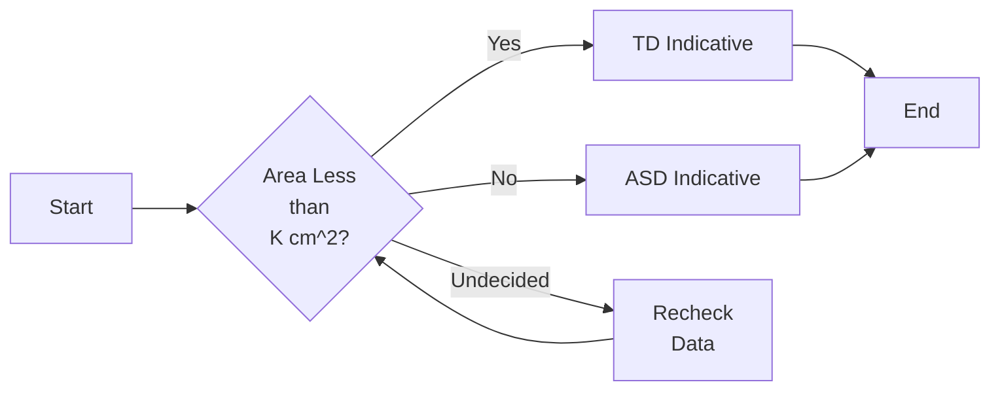
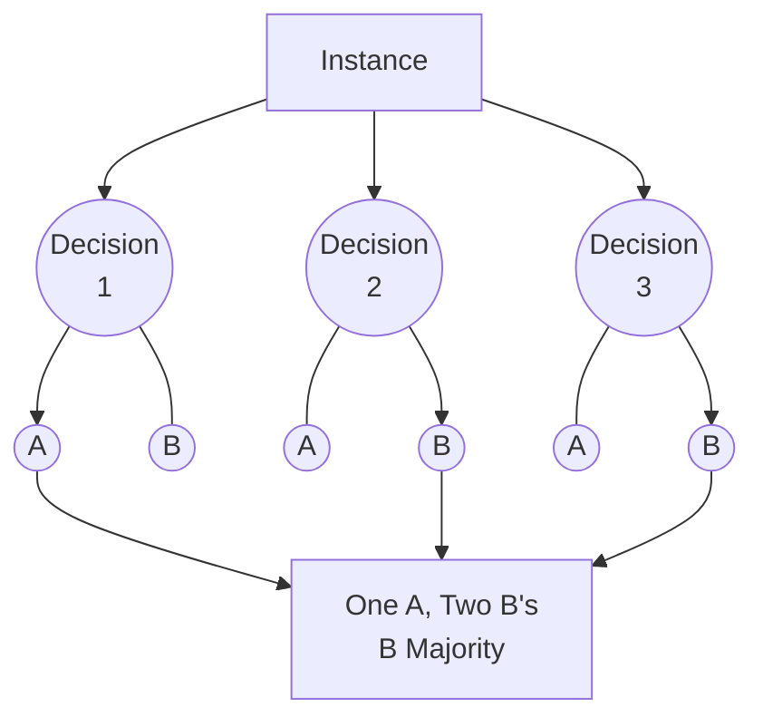

[[Table of Contents W3]]

## <u>**Supervised Learning Algorithms**

### ==K-Nearest Neighbor==

---
When given a new point the K-Nearest Neighbor algorithm is able to predict the classification of the data point based on the nearest neighbors to that point or new set of data. As an example for visuals these are shown for a graphically assigned new point and not indicative of entirely new data.

The distance between the data is calculated in a simplistic way, but has multiple variations applied to it. These equations can be seen [here](https://www.ibm.com/topics/knn#:~:text=The%20k-nearest%20neighbors%20algorithm%2C%20also%20known%20as%20KNN%20or,of%20an%20individual%20data%20point.).

The most encompassing distance equation is shown below, the Minkowski Distance:

$$D(X,Y)=\Bigg(\sum_{i=1}^n|x_{i} - y_i|^p\Bigg)^{1/p}$$

**Whenever $p = 2$ the formula is indicative of Euclidian distance**, whereas $p=1$ represents Manhattan distance. For this case I believe Euclidian distance is most likely the one used since these are real values and also $p=2$ will obtain a vector between the points.

This could be done by taking the mean values and finding the K-Nearest neighbor, or perhaps <u>**plotting the area values themselves on a separate chart, and comparing them that way.**

![[0_jqxx3-dJqFjXD6FA.png|400]]

Where the red dot is the point wanting to be classified and the different radii are the supposed ranges used to find the likelihood of classification of the new unknown point.

---
### ==Naïve Bayes==

A supervised machine learning algorithm. The base equation is as follows:

$$p(C_k\:|\:x)= \frac{p(C_k)p(x\:|\:C_k)}{p(x)}$$
From wikipedia this can be rewritten as:
$$posterior = \frac{prior\times likelihood  }{evidence}$$

This method of machine learning is based on previous data with their means and variances for all values to be considered when predicting new data. This methodology is complicated honestly but here are the equations with intermittent explanation.

Posterior probability is seemingly specific to Bayesian statistics and is what we are calculating. Evidence is based on the total data set previously gathered.
The data is assumed gaussian and the probability for each specific classification for the data is represented as such.

$$\begin{equation} 
\Huge
p(x=v\:|\:C_k)=\frac{1}{\sqrt{2\pi\sigma_k^2}}e^{-\frac{(v-\mu_k)^2}{2\sigma^2_k}}
\end{equation}
$$

In this equation the posterior of the new item being $C_k$ based off of a single attribute $x=v$ is calculated. On [wikipedia](https://en.wikipedia.org/wiki/Naive_Bayes_classifier#Examples) they use the example of predicting a persons gender based on height, weight, and foot size. These values are given as means and variances of the entire data set.

For the specific type $v$, on wikipedia either height, weight or shoe size, $\huge \sigma_k^2$, is the variance of the specified value. $\huge \mu_k$ is the average for that given variable from previous data, and $v$ is the data provided for the new data point to be used against the average.

Looking at the wikipedia page again will give a good refresher on how this exactly works, but it is fairly straightforward. In the end all posterior values are multiplied together to produce the final posterior value, and ==whichever one is higher between the different classifications is the most likely option.==

### ==Decision Trees==

Decision trees are fairly straighforward and have been done many, many times before for various applications. I assume these will require cutoff values and an eventual cascade to decide whichever classification the new data is assumed to be.

The decision tree is usually made up of several `if...else` statements to facilitate the decisions.

This is a very basic design of what a decision tree might look like. More specific parameters can be chosen so that the data does not have such a biased cutoff point. However there is always bias.

==Look further into how this is actually used for prediction. Could be good if total path length is also considered for this.==

### ==Linear Regression==
Since for the area of postural sway is calculated using only x and y and also since there are only two cases, ASD or TD, linear regression could theoretically be used to decide whether or not a new case is going to be either ASD or TD.

Linear regression merely creates a linear equation to exemplify the progression of data if it has a linearity to it.
Linear equations take the general form of:
$$\large
Y = a +b X
$$
Where $X$ is the independent variable and $Y$ is the dependent variable. The values $a$ and $b$ are both calculated constants to provide the slope and intercept of the plotted line.

Using least-squares method is typically done using these equations:
$$\huge
a= \frac{(\Sigma y)(\Sigma x^2)-
(\Sigma x)(\Sigma xy)
}{
n(\Sigma x^{2})-(\Sigma x)^2
}
$$

Where $a$ is considered the y-intercept. The values $x$ and $y$ are the independent and dependent variables provided by the known data. The value $n$ is the total number of unique data points of $(x,y)$.

$$\huge
b = \frac{
n(\Sigma xy)-(\Sigma x)(\Sigma y)
}
{n(\Sigma x^{2})-(\Sigma x)^{2}}
$$

This $b$ is the slope of the line. The variables are the same as when calculating the y-intercept which is why these are generally calculated separately and reused.

The line is calculated from given data, then predicts based on that line, ==most likely using conditions based on the calculated error that would be proposed by accepting that new data one way or another.==

### ==Random Forest==
Random forest is based off of majority voting for a classification of data. These use a combination of decision trees with a weighted training algorithm to accurately predict the desired outcome.

A random forest would look something like this in a practical model sense of 3 model decision trees:

I believe the random forest could have more accurate representation of data compared to the single decision tree due to the various nature of the random forest.
### Discriminant Analysis

### Support Vector Machine